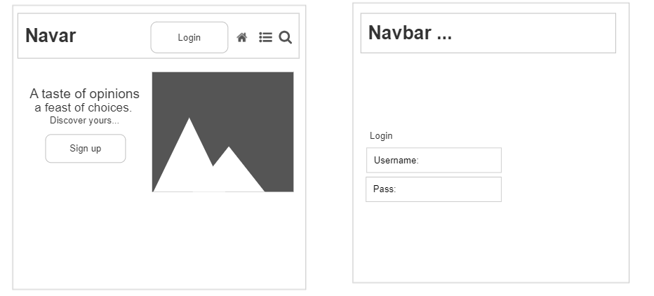
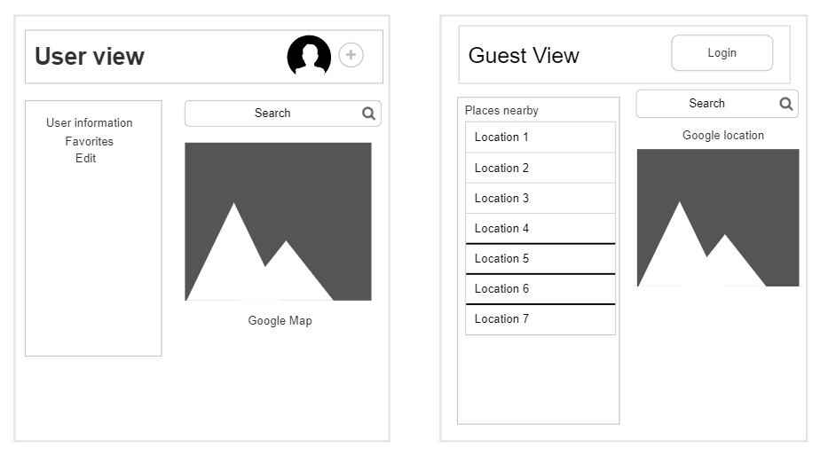
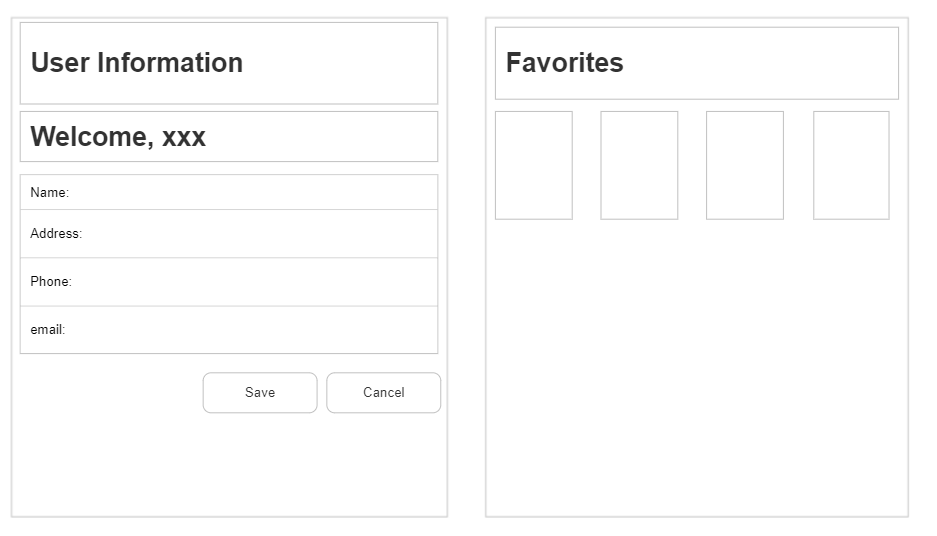
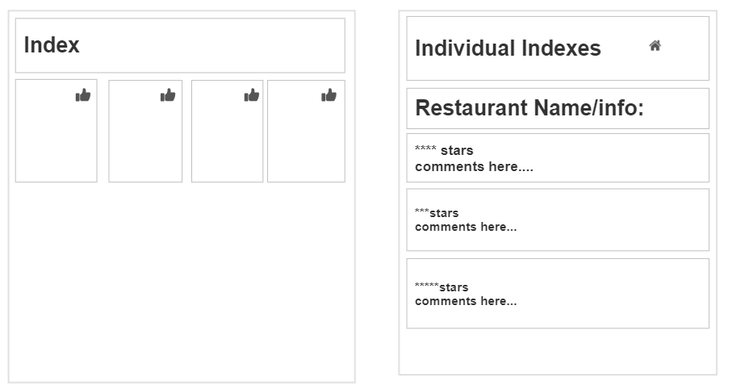
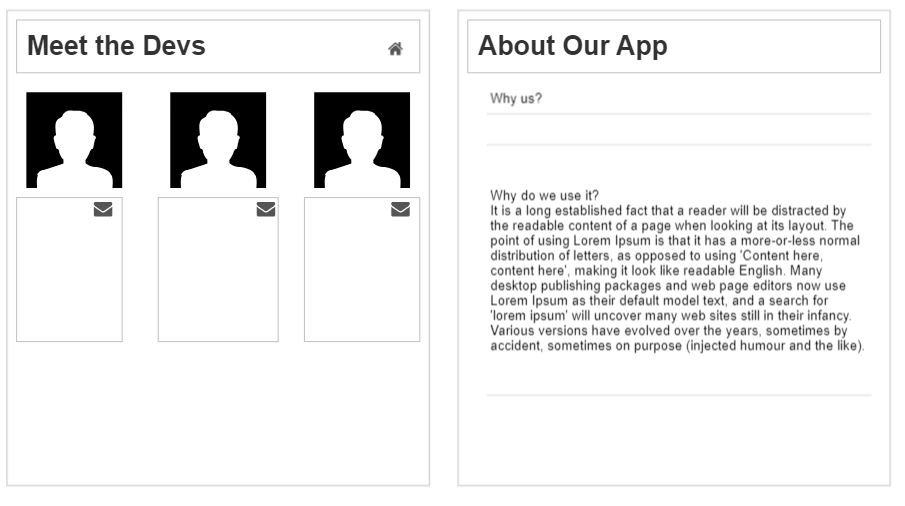

# Capstone
Capstone project for Dev10 Training

## Installs Required
- npm i react-icons
- npm i @react-google-maps/api
- npm i react-router-dom@6
- npm i -D tailwindcss
- npx tailwindcss init
- npm i jwt-decode

## Learning goals
- To design, implement, and test a database-backed application with an HTML user interface delivered via HTTP
  - Tailwindcss
  - Google APIs through @react-google-maps/api

## Technical Requirements
1. Manage 4-7 database tables (entities) that are independent concepts. A simple bridge table doesn't count.
2. Relational database for data management
3. Spring Boot, MVC (@RestController), JdbcTemplate, Testing
4. An HTML and CSS UI built with React
5. Sensible layering and pattern choices
6. At least one UI secured by role
7. A full test suite that covers the domain and data layers.

## Scheduling
### Set up database schema (2 hours)
  - [x] Decide Tables needed
  - [x] Determine table relationships and bridge tables needed
  - [x] Establish DML default data 

### Create data models for each table (3 hours)
  - [x] app_user
    - id, username, password hash, enabled
  - [x] restaurant
    - id,  name, address, zipcode, website, email, phone, latitude, longitude, state, city, hoursInterval, cuisineType 
  - [x] user_profile
    - id, first name, last name, address, app_user id
  - [x] meal
    - id, name, price, description (text body), lastUpdated, appUserId, restaurantId
  - [x] comment
    - id, description, postDate, isPublic
  - [x] rating
    - id, score (1-5)

### Create Data Repositories for each model (2 hours/model)
  - [x] CRUD
    - [x] Unit Testing
  - [x] Queries for add, update, and delete.
  - [x] Mappers
  - [ ] Aggregation needed for sort, filter, avg, etc incorporated into repo methods

### Domain layer for each model that is needed (2 hours/repo)
  - [x] User
    - [x] Username and password must be unique
    - [x] Password might require certain character types and length
      - Regex?
  - [x] Rating
    - [x] Rating cannot be beyond limit (1-5 stars)
  - [x] Comment
    - [x] Comment cannot be blank
  - [x] Meal
    - [x] Validation
    - [x] Testing 
  - [x] Restaurant

### Controllers for each model (5 hours)
  - [x] Comments
  - [x] Rating
  - [x] User login
  - [x] Meal
  - [x] Restaurant (many edits)
  - A filter/aggregation controller maybe

### Google Maps/Places
  - [x] Get a map working
    - [x] Geolocation: display current user/device position on map
  - [x] Markers and InfoWindows
    - [x] Show details for nearby restaurants
      - Filters ?
      
         
### Website Components
- TailwindCss Docs (ongoing)
- [x] Header/NavBar
  - [x] Landing Page
  - [x] Login
  - [x] User View (once logged in)
  - [x] Guest View (not logged in + search)
  - [x] Map component (featured in user/guest view)
  - [ ] User Page (User Info)
    - displays user profile, options to change/update
  - [ ] Favorites
    - User's restaurants
    - mentioned sorting the list of added restaurants for the individual user (e.g., by rating)
  - [ ] Individual Indexes
    - [ ] User's/Ratings
    - [ ] User's/Comments
    - [ ] User's/Meals
  - [ ] Meal CRUD
  - [ ] Meet The Devs
    - [x] Simple introduction
    - [x] links to git, linkedin, and email
    - [ ] fix layout
  - [ ] About 
    - [x] Soft pitch 
    - [x] Highlight current functionality
    - [ ] Decorate!
- [x] Footer

## User Story/Problem 
When you need to choose a restaurant to eat at. 
When you want to keep track of bad and good experiences at each place. 
Also, when you travel frequently between cities with work and home, keeping track of multiple cities with multiple franchise locations.

## Features
- Share Favorite Restraunt list
- Comments/Reviews of visits
- Personal 5 star rating system
- Restaurant info displayed for each location - (hours, address, etc.)
- Map with indexed restaurant info and location markers
- Add a list of favorite meals with prices, good for remembering meals for SO as well.
- Social Page would have aggregated rating, public comments.
- If possible, have a public api that can find other local restaurants and reviews by others or have a local social network that shows other’s popular restaurants.
- Filter user’s restaurant by if open or not.

## Visuals

### LucidChart Class Diagram Link (Last Updated 07/03/2023): 
- https://lucid.app/lucidchart/99ffb33f-e8e3-4626-97cd-85c6518230cd/edit?viewport_loc=163%2C173%2C2069%2C1241%2CHWEp-vi-RSFO&invitationId=inv_6348064c-0247-4640-a913-5c310aef9d37

### Wireframe UI

### Schema Diagram (Needs update)

